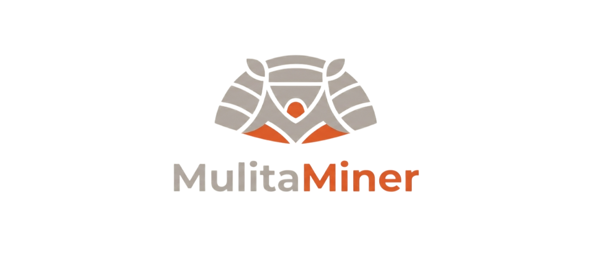

<div align="center">

  <picture>
    <source media="(prefers-color-scheme: dark)" srcset="imgs/MulitaMiner_logo_light.png">
    <source media="(prefers-color-scheme: light)" srcset="imgs/MulitaMiner_logo_dark.png">
    
  </picture>

**Vulnerability Extraction from Security Reports using LLMs**


</div>

# MulitaMiner

Extracts structured vulnerability records from security-scanner PDF reports
using LLMs, and exports them to the formats real tools ingest.

The core idea is block-anchored extraction: the report is split
deterministically into blocks (one block = one finding) before any LLM call.
The model fills the fields of each block instead of "discovering"
vulnerabilities, so the output count always matches the report.

## Pipeline


1. **PDF**: the scanner report goes in.
2. **Extract text**: pull clean text out of the PDF.
3. **Split blocks**: cut the text into one block per finding, deterministically, so the finding count is known before any LLM call.
4. **LLM extract**: the model fills the fields of each block; block ids keep one record per finding.
5. **Consolidate**: pair base and instances, normalize severity, merge identical records.
6. **results.json**: the structured records, the primary artifact.
7. **Exports**: optional SARIF, CSAF, DefectDojo Generic, CSV, XLSX.

One module per stage in `src/mulitaminer/`. Everything between stages stays
in memory.

## Supported

| | |
| --- | --- |
| Scanners | OpenVAS/Greenbone, Tenable WAS (add your own with a JSON config) |
| Cloud models | DeepSeek, OpenAI (gpt-4o, gpt-4o-mini), Groq (Llama 3.3 70B) |
| Local models | Ollama, LM Studio, any OpenAI-compatible server. No API key needed |
| Exports | XLSX, CSV, SARIF 2.1.0, DefectDojo Generic JSON, CAIS, CSAF 2.0 |

## Quickstart

```bash
uv sync
cp .env.example .env    # fill in the keys for the cloud providers you use

# Extract and also write a spreadsheet
uv run mulitaminer extract report.pdf --scanner openvas --model deepseek --export xlsx

# Generate more exports later from the same run, no LLM calls
uv run mulitaminer export outputs/runs/<run_dir> -e sarif -e csaf

# Rank findings into a remediation queue (KEV/EPSS/SSVC)
uv run mulitaminer sync-feeds
uv run mulitaminer prioritize outputs/runs/<run_dir>

# Test a scanner config offline and free
uv run mulitaminer segment report.pdf --scanner openvas
```

Each run creates `outputs/runs/<timestamp>_<input>_<model>/` with
`results.json` (the records), `run.json` (config, tokens, cost, warnings) and
one file per requested export.

## Documentation

| Document | Description |
| --- | --- |
| [docs/INSTALL.md](docs/INSTALL.md) | Requirements, installation and a keyless verification run |
| [docs/USAGE.md](docs/USAGE.md) | All commands, flags, run artifacts and examples |
| [docs/CONFIG.md](docs/CONFIG.md) | API keys, model profiles and tunables |
| [docs/ADDING_A_MODEL.md](docs/ADDING_A_MODEL.md) | Plug a new LLM, cloud or local |
| [docs/ARCHITECTURE.md](docs/ARCHITECTURE.md) | Pipeline stages, modules and design rules |
| [docs/SCANNER_CONFIGS.md](docs/SCANNER_CONFIGS.md) | Adding a scanner and the built-in config rationale |
| [docs/EXPORTS.md](docs/EXPORTS.md) | Export formats, who consumes each, field mapping |
| [docs/PRIORITIZATION.md](docs/PRIORITIZATION.md) | KEV/EPSS/SSVC remediation queue for a run |
| [docs/TROUBLESHOOTING.md](docs/TROUBLESHOOTING.md) | Symptoms, causes and fixes |

## Development

```bash
uv run pytest    # full suite, offline (fake LLM)
```

Design history and the phased plan live in `docs/superpowers/`.

## License

[MIT](LICENSE). Free to use, modify and distribute, including commercially.
Provided "as is", without warranties; you are responsible for the secure
handling of your data and API keys.
