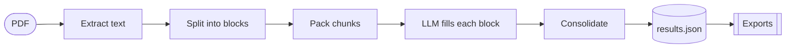

# MulitaMiner

Extracts structured vulnerability records from security-scanner PDF reports
using LLMs, and exports them to the formats real tools ingest.

The core idea is block-anchored extraction: the report is split
deterministically into blocks (one block = one finding) before any LLM call.
The model fills the fields of each block instead of "discovering"
vulnerabilities, so the output count always matches the report.

## Pipeline



One module per stage in `src/mulitaminer/`: `pdf_reader`, `scanner_engine`,
`chunking`, `llm` + `extraction`, `consolidate`, `writers`, `exporters/`.
Everything between stages stays in memory.

## Supported

| | |
| --- | --- |
| Scanners | OpenVAS/Greenbone, Tenable WAS (add your own: see below) |
| Cloud models | DeepSeek, OpenAI (gpt-4o, gpt-4o-mini), Groq (Llama 3.3 70B) |
| Local models | Ollama, LM Studio, any OpenAI-compatible server. No API key needed |
| Exports | XLSX, CSV, SARIF 2.1.0, DefectDojo Generic JSON, CAIS, CSAF 2.0 |

## Install

```bash
uv sync
cp .env.example .env    # fill in the keys for the cloud providers you use
```

## Usage

```bash
# Extract with DeepSeek and also write a spreadsheet
uv run mulitaminer extract report.pdf --scanner openvas --model deepseek --export xlsx

# Multiple exports: repeat the flag
uv run mulitaminer extract report.pdf -s openvas -m deepseek -e sarif -e generic

# Local model via Ollama, no key
uv run mulitaminer extract report.pdf -s tenable -m ollama --model-name qwen3

# Write inspection artifacts (layout, blocks, raw LLM traffic) into the run dir
uv run mulitaminer extract report.pdf -s openvas -m deepseek --debug

uv run mulitaminer models     # model profiles and their env vars
uv run mulitaminer scanners   # available scanners
uv run mulitaminer formats    # export formats and what consumes each
```

## Outputs

Each run creates `outputs/runs/<timestamp>_<input>_<model>/` containing:

| File | Content |
| --- | --- |
| `results.json` | The extracted records (primary artifact) |
| `run.json` | Config snapshot, token/cost accounting, duration, warnings, merge log |
| `results.raw.json` | Pre-consolidation records, written only when merges happened |
| `results.<format>.*` | One file per `--export` |
| `layout.txt`, `blocks.txt`, `llm_traffic.jsonl`, `debug.log` | Only with `--debug` |

Consolidation always runs: Tenable base+instances pairing, severity
normalization (INFO becomes LOG), and merging of fully identical records.
Findings that repeat with different content are never merged.

## Adding a scanner

A scanner is one JSON config plus one prompt file, no Python. Drop
`<name>.json` and `<name>.txt` into a folder and point the
`MULITAMINER_SCANNERS_DIR` env var at it. Test the config offline and for
free with:

```bash
uv run mulitaminer segment report.pdf --scanner <name>
```

The block count must equal the report's finding count. Full guide and the
rationale behind the built-in configs: [docs/SCANNER_CONFIGS.md](docs/SCANNER_CONFIGS.md).

## Development

```bash
uv run pytest    # full suite, offline (fake LLM)
```

Design history and the phased plan with verification state live in
`docs/superpowers/`. Backend comparison and parity tools live in `tools/`.

## License

MIT.
