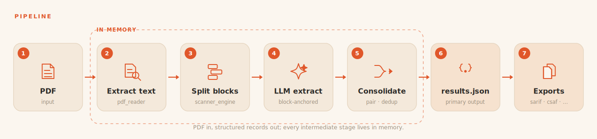

# Architecture

## Pipeline

All intermediate state flows in memory as typed Pydantic objects. Disk is
touched only for final run artifacts and optional `--debug` dumps.

## Modules

| Module | Responsibility |
| --- | --- |
| `pdf_reader.py` | PDF text extraction (pypdfium2 default, pdfplumber fallback) + cleanup |
| `scanner_engine.py` | Builds a ScannerProfile (segmenter + consolidator) from a JSON config |
| `chunking.py` | Packs whole blocks into token-budgeted chunks; blocks are never split |
| `llm.py` | One OpenAI-compatible client; structured output; usage accounting |
| `extraction.py` | Block-anchored loop: block_id reconciliation, shrinking retries, truncation |
| `consolidate.py` | Pairing, severity normalization, merge of fully identical records |
| `models.py` | VulnRecord and subclasses; the LLM contract is derived from them |
| `writers.py` / `exporters/` | results.json plus the `--export` formats |
| `evaluation/` | Schema-driven scoring of a run against a baseline (align, scorers, fields, report) |
| `prioritization.py` | KEV/EPSS/SSVC remediation queue over a run's results.json |
| `pipeline.py` | Composes the stages into one run; directory mode auto-detects the scanner |
| `experiment.py` | X runs per (model, report); parallel by capacity bucket, checkpointed |
| `cli.py` | Typer commands; thin consumer of the library |
| `settings.py` | Calibrated tunables |

## Key design rules

- **Block-anchored extraction**: segmentation determines the finding count
  deterministically before any LLM call. Each block carries an id; the model
  must return exactly one record per id. Missing ids are re-sent in smaller
  groups (4, then 2, then 1); unknown or duplicate ids are dropped with a
  warning. The raw output count therefore equals the report's marker count.
- **Typed end to end**: records are born validated from structured LLM output
  and stay objects until serialization. Post-validation writes are also
  schema-checked.
- **Failures are declared, never silent**: dropped blocks, truncated oversized
  blocks and merges all land in `run.json` warnings and merge log.
- **Scanner knowledge lives in one place**: the JSON config. The engine
  interprets it; no scanner-specific Python. The same marker patterns that
  segment a report also identify its scanner (directory-mode auto-detection).
- **Metrics are derived from the schema, not hardcoded**: the evaluation
  subsystem reads the record model's fields and infers the metric per field
  (exact for numeric/categorical, text scorers for prose, structural for
  nested), so a new schema field is scored without touching evaluator code.

## Data flow objects

`Block` (one finding segment with host/port context), `Chunk` (group of whole
blocks), `VulnRecord` (validated record), `RunResult` (records + usage +
warnings). All in `models.py`.
