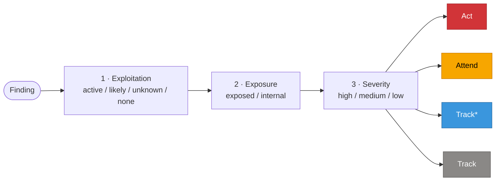

# Prioritization

Ranks a run's findings into a remediation queue using three public signals.
Deterministic and auditable: no LLM in the ranking, and every signal behind a
decision is a column in the output, so a category can be re-derived by hand.

| Signal | Source | Meaning |
| --- | --- | --- |
| KEV | [CISA Known Exploited Vulnerabilities](https://www.cisa.gov/known-exploited-vulnerabilities-catalog) | The CVE is exploited in the wild |
| EPSS | [FIRST.org EPSS](https://www.first.org/epss/) | Probability of exploitation in the next 30 days |
| SSVC | [CISA SSVC](https://www.cisa.gov/ssvc) | Act / Attend / Track category per finding |

CVE ids come from each record's `references` and, for Tenable, its
`plugin_details`. Findings without a CVE are handled explicitly (see the tree
below), never silently assumed safe.

## Usage

```bash
# 1. Sync the feeds (KEV + EPSS, ~5 MB, needs internet). Re-run to refresh.
uv run mulitaminer sync-feeds

# 2. Rank a run (offline; reads the local snapshot)
uv run mulitaminer prioritize outputs/runs/<run_dir>
```

`prioritize` accepts a run directory or a `results.json` path directly. It
writes, next to that `results.json`:

- `results.prioritization.csv` (utf-8-sig, opens cleanly in Excel)
- `results.prioritization.xlsx`

one row per finding, most urgent first. It fails with a clear message if the
feeds were never synced.

The feed snapshot lives in `outputs/feeds/` (gitignored, regenerable). It is
never fetched at ranking time; only `sync-feeds` writes it.

## Columns

| Column | Meaning |
| --- | --- |
| `rank` | Position in the queue |
| `name`, `host` | Finding identity |
| `category` | SSVC decision: Act > Attend > Track\* > Track |
| `exposure` | `exposed` or `internal` |
| `exploitation` | `active`, `likely`, `none`, or `unknown` |
| `severity` | `high` / `medium` / `low` |
| `kev` | Whether any CVE is in the KEV catalog |
| `epss` | Highest EPSS score among the finding's CVEs |
| `cvss` | The numeric CVSS, when present |
| `cves` | The CVE ids found |
| `justification` | One-line reason for the category |
| `snapshot_date` | EPSS score date of the feed snapshot used |

## How each signal is derived

**exposure**: `internal` only when the host is confidently private (a private,
loopback, link-local or reserved IP, a single-label name like `srv01`, or an
internal-looking suffix such as `.local` / `.internal` / `.corp`). Everything
else, including a missing host or a web-scan URL, defaults to `exposed`. The
heuristic can only move a finding to internal, never wrongly downgrade a public
asset.

**exploitation**:

- `active`: a CVE is in KEV.
- `likely`: the highest EPSS among the CVEs is at least 0.10 (FIRST's
  near-F1-optimal remediation cutoff).
- `none`: has a CVE, but KEV and EPSS show little evidence (we checked).
- `unknown`: no CVE at all, so KEV/EPSS cannot be consulted. Common for
  Tenable WAS findings (XSS, SQLi with no CVE).

**severity**: `high` at CVSS >= 7, `medium` at >= 4, else `low`. With no
numeric CVSS, the scanner's severity label is used (Critical/High -> high,
Medium -> medium, everything else -> low).

## Decision tree

`unknown` (no CVE) follows the same path as `likely`: no CVE is absence of
evidence, not evidence of safety, so it is never discounted as safe.

Three inputs are read in order, mapping to one category:



The exact mapping (`unknown` follows the same row as `likely`):

| Exploitation | Exposure | high | medium | low |
| --- | --- | :---: | :---: | :---: |
| active | exposed | Act | Act | Attend |
| active | internal | Act | Attend | Track\* |
| likely / unknown | exposed | Act | Attend | Track\* |
| likely / unknown | internal | Attend | Track\* | Track |
| none | exposed | Attend | Track\* | Track |
| none | internal | Track\* | Track | Track |

## Categories

| Category | Urgency | Meaning |
| --- | --- | --- |
| **Act** | Highest | Remediate now: exploited or high-stakes exposure |
| **Attend** | High | Bring to the response team soon; needs supervised action |
| **Track\*** | Moderate | Monitor; act if it worsens (a notch above plain Track) |
| **Track** | Lowest | Keep an eye on it; no action needed for now |

## Ordering

Within a category, rows are ordered by EPSS descending, then CVSS descending.
Two findings in the same category are equally urgent by SSVC; the tiebreak
surfaces the more probable one first. A KEV finding with no EPSS score can
therefore sit below a high-EPSS finding of the same category; both are still
`Act`.

## Tuning

The EPSS `likely` threshold (`EPSS_LIKELY_THRESHOLD`, default 0.10) and the
decision tree itself live in `src/mulitaminer/prioritization.py`. Both are
plain constants; edit them to match your risk tolerance. The feed directory is
`FEEDS_DIR` in `settings.py`.
